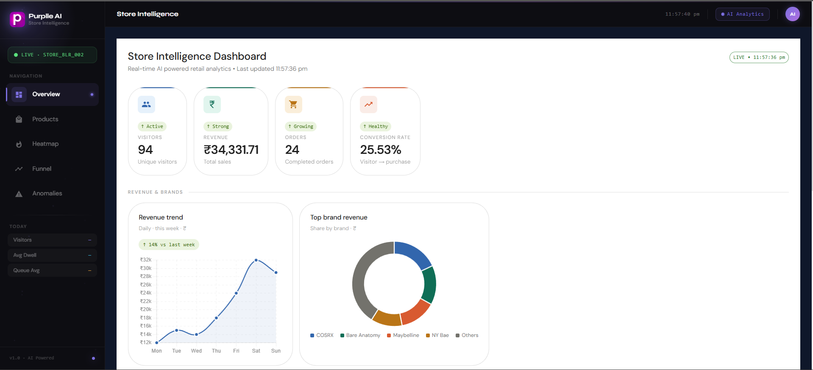
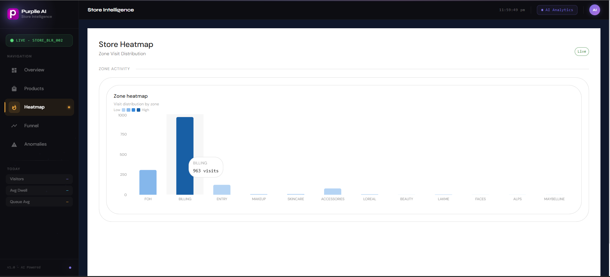
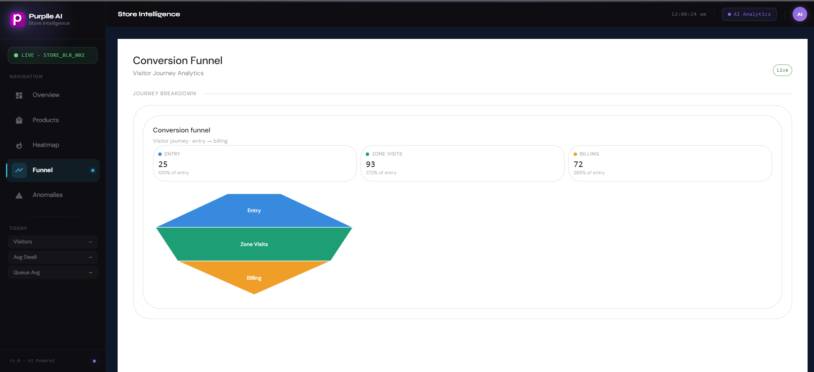
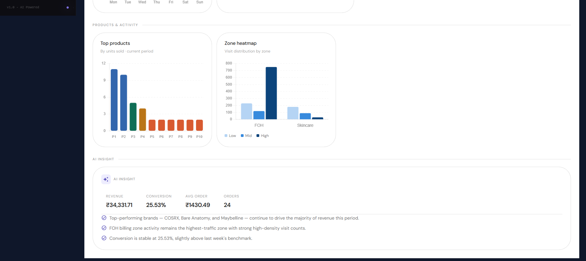

# Store Intelligence System

> AI-powered retail analytics platform that transforms CCTV video streams and POS transaction data into real-time, actionable business insights.

---

## Overview

Store Intelligence System combines computer vision, multi-object tracking, and event-driven analytics to give retailers deep visibility into customer behavior — without storing any personally identifiable data.

The platform processes raw video feeds through a layered pipeline: detecting people with YOLOv8, tracking them across frames with ByteTrack, converting movement into structured business events, and surfacing insights through a FastAPI backend and React dashboard.

**Core capabilities:**

- Real-time person detection and tracking across CCTV feeds
- Zone-level dwell time, entry/exit, and path analytics
- Billing queue monitoring and congestion detection
- Conversion funnel from store entry to purchase
- Product and brand performance analytics
- Anomaly detection for operational issues

---

## System Architecture

```
Video Input
    ↓
Detection Layer     →  YOLOv8 (bounding boxes + confidence scores)
    ↓
Tracking Layer      →  ByteTrack (persistent visitor IDs + paths)
    ↓
Event Layer         →  Business event generation
    ↓
Session Layer       →  Customer journey aggregation
    ↓
Analytics Layer     →  Metrics, funnels, heatmaps, anomalies
    ↓
API Layer           →  FastAPI REST endpoints
    ↓
Dashboard Layer     →  React + Recharts visualization
```

---

## Challenge Requirements Coverage

| Requirement             | Status | Notes                                      |
|-------------------------|--------|--------------------------------------------|
| ENTRY                   | ✅      | Detected at store boundary                 |
| EXIT                    | ✅      | Detected at store boundary                 |
| ZONE_ENTER              | ✅      | Triggered on zone boundary cross           |
| ZONE_EXIT               | ✅      | Triggered on zone boundary cross           |
| ZONE_DWELL              | ✅      | Emitted after configurable dwell threshold |
| REENTRY                 | ✅      | Detected via session gap analysis          |
| BILLING_QUEUE_JOIN      | ✅      | Detected via billing zone proximity        |
| BILLING_QUEUE_ABANDON   | ✅      | Detected via exit before purchase event    |

---

## Features

### Detection & Tracking

- Person detection using YOLOv8 (nano / small variants for real-time performance)
- Multi-object tracking using ByteTrack with persistent visitor IDs
- Zone mapping with configurable polygon boundaries
- Entry / exit line crossing detection
- Billing queue region monitoring

### Event Layer

All customer interactions are modeled as discrete, auditable business events:

```
ENTRY  →  ZONE_ENTER  →  ZONE_DWELL  →  ZONE_EXIT  →  BILLING_QUEUE_JOIN  →  EXIT
                                                     ↘  BILLING_QUEUE_ABANDON
REENTRY (detected on second store crossing within session window)
```

### Analytics Layer

| Category             | Metrics                                                              |
|----------------------|----------------------------------------------------------------------|
| Visitor Analytics    | Unique visitors, repeat visits, peak hours, dwell time distribution |
| Conversion Funnel    | Entry → Zone Visit → Billing → Purchase                              |
| Revenue Analytics    | Total revenue, revenue per visitor, conversion rate                  |
| Product Analytics    | Top products by visits and purchase correlation                      |
| Brand Analytics      | Brand-level zone engagement and conversion                           |
| Heatmap              | Zone visit frequency, dwell intensity                                |
| Anomaly Detection    | Billing congestion, queue spikes, conversion drops                   |

### Dashboard

- Overview KPIs with auto-refresh every 5 seconds
- Live timestamp and session counters
- Conversion funnel visualization
- Zone heatmap
- Anomaly alerts feed
- Product and brand performance tables

---

## API Endpoints

| Method | Endpoint          | Description                          |
|--------|-------------------|--------------------------------------|
| GET    | `/health`         | Service health check                 |
| GET    | `/metrics`        | Aggregated visitor and revenue KPIs  |
| GET    | `/funnel`         | Conversion funnel data               |
| GET    | `/heatmap`        | Zone visit frequency heatmap         |
| GET    | `/anomalies`      | Detected operational anomalies       |
| GET    | `/products`       | Product-level analytics              |
| GET    | `/brands`         | Brand-level analytics                |
| POST   | `/events/ingest`  | Ingest raw tracking events           |

Full OpenAPI documentation available at `/docs` when the backend is running.

---

## Project Structure

```
store-intelligence/
├── backend/
│   ├── app/
│   │   ├── main.py
│   │   ├── routers/
│   │   ├── services/
│   │   └── models/
│   └── requirements.txt
├── dashboard/
│   ├── src/
│   │   ├── components/
│   │   └── pages/
│   └── package.json
├── pipeline/
│   ├── detection/
│   ├── tracking/
│   └── events/
├── tests/
├── docs/
├── Dockerfile.backend
├── Dockerfile.dashboard
└── docker-compose.yml
```

---

## Running Locally

### Prerequisites

- Python 3.10+
- Node.js 18+
- SQLAlchemy ORM
- Optional PostgreSQL integration for production deployments
- Docker & Docker Compose (optional)

### Backend

```bash
cd backend
pip install -r requirements.txt
python -m uvicorn app.main:app --reload
```

Backend runs at `http://localhost:8000`. OpenAPI docs at `http://localhost:8000/docs`.

### Dashboard

```bash
cd dashboard
npm install
npm run dev
```

Dashboard runs at `http://localhost:5173`.

### Docker (Recommended)

```bash
docker compose up --build
```

Starts backend and dashboard services with a scalable, database-ready architecture.

---

## Testing

```bash
python -m pytest tests -v
```

**Current result: 11 tests passing**

| Test Suite               | Coverage                                         |
|--------------------------|--------------------------------------------------|
| Event ingestion          | ENTRY, EXIT, ZONE_*, BILLING_*, REENTRY          |
| Analytics endpoints      | Metrics, funnel, heatmap, anomalies              |
| Edge cases               | Reentry detection, queue abandonment logic       |

---

## Dashboard Preview

### Overview Dashboard
<p align="center">
  
</p>

### Heatmap Analytics
<p align="center">
  
</p>

### Conversion Funnel
<p align="center">
  
</p>

### AI Insights
<p align="center">
  
</p>

---

## Technologies

| Layer            | Technology                              |
|------------------|-----------------------------------------|
| Computer Vision  | YOLOv8, ByteTrack, OpenCV               |
| Backend          | FastAPI, SQLAlchemy, Pandas (PostgreSQL-ready architecture) |
| Frontend         | React, Material UI, Recharts, Axios     |
| Deployment       | Docker, Docker Compose                  |

---

## Security & Privacy

- **No facial recognition** is used at any point in the pipeline
- Visitor IDs are anonymous, ephemeral, and not linked to any personal data
- GDPR-friendly by design — the system tracks movement patterns, not individuals

---

## Future Roadmap

- Real-time WebSocket streaming for live dashboard updates
- Kafka event streaming for high-volume multi-camera deployments
- Redis caching layer for sub-millisecond analytics queries
- Multi-store aggregation and cross-store comparison
- Staff exclusion via badge-based detection
- Predictive revenue analytics using historical patterns
- AI-powered product placement recommendations
- Kubernetes deployment for horizontal scaling